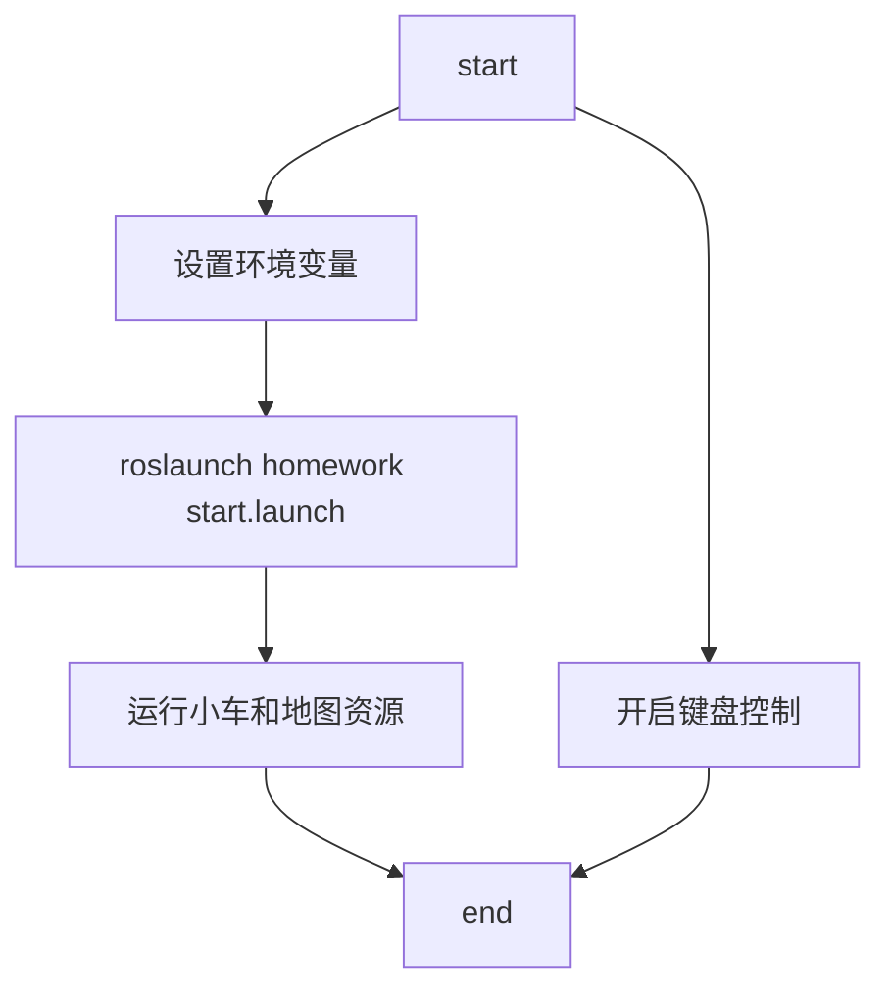
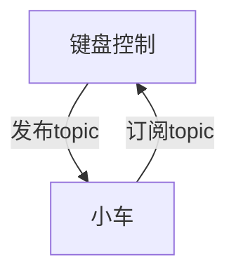

```mermaid
graph TD
	A[start] -->B[开启键盘控制]
	A -->C[设置环境变量]
	C -->D[roslaunch homework start.launch]
	D -->E[运行小车和地图资源]
	E -->F[end]
	B -->F
```

```mermaid
graph TD
	A[键盘控制] -->|发布topic|B[小车]
	B -->|订阅topic|A
```

